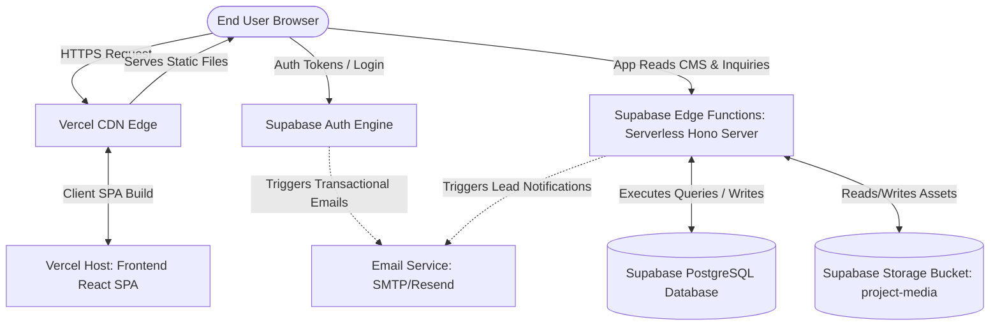

# SAPX Design Portfolio: Enterprise Production Deployment Manual

This document is a comprehensive, production-grade deployment handbook for the **SAPX Design Portfolio** web application. It is designed to guide a non-technical founder or developer through a step-by-step, zero-downtime launch from local development to a live, secure, custom-domain production environment under your verified domain **https://sapxdesign.com/**.

---

## Architecture Diagram Overview

Below is the production data flow and system architecture:



---

## Phase 1: Project Analysis

A thorough analysis of the codebase reveals the following architecture:

### 1. Frontend Framework
* **Core Technology:** React (v18/19), TypeScript, and Tailwind CSS (v4.1.12 with Vite integrations).
* **Router:** React Router v7 / React Router DOM for routing.
* **Component Library:** Material UI (MUI v7) and Radix UI primitives for high-fidelity animations, slider controls, and premium interactions.
* **Build Tool:** Vite (v6.3.5) with TypeScript config compilation.
* **Output Assets:** Bundled static assets outputted to the `dist/` directory on build.

### 2. Backend Architecture & Integrations
* **Database:** PostgreSQL hosted on Supabase, managed via SQL migrations located in [20260613000000_crm_schema.sql](file:///workspaces/Sapxdesign/supabase/migrations/20260613000000_crm_schema.sql).
* **API Gateway Layer:** A Supabase Edge Function built on Hono and Deno (located in [supabase/functions/server/index.tsx](file:///workspaces/Sapxdesign/supabase/functions/server/index.tsx)). The frontend communicates with this function endpoint under the tokenized path: `/functions/v1/server/make-server-f1100bc4`.
* **Database Bypass (Mock Engine):** Managed via [api.ts](file:///workspaces/Sapxdesign/src/app/services/api.ts). When the environment variables are not detected, the app gracefully runs in placeholder mode using an in-browser Local Storage engine.
* **Storage:** Public/private assets storage managed through Supabase Storage bucket `project-media` for project imagery, cover photos, and client documents.
* **Authentication:** Supabase Auth for admin panel verification and secure CRUD routes.

---

## Phase 2: Hosting Recommendation

To deploy a high-performance, cost-effective website, we compare the leading hosting architectures:

| Platform | Cost Structure | Scalability | Maintenance Overhead | Built-in Security Features |
| :--- | :--- | :--- | :--- | :--- |
| **Vercel** | **Free Tier (Hobby); $20/mo (Pro)** | **Elite (Edge CDN, global distribution)** | **Zero (Automated Git integrations)** | **Free DDoS protection, automatic SSL, Web Application Firewall (WAF)** |
| **Netlify** | Free Tier; $19/mo (Pro) | Excellent (Edge CDN) | Very Low | Automated SSL, basic DDoS |
| **AWS Amplify / S3** | Pay-as-you-go (complex) | Infinite (Requires configuration) | High (Requires IAM, CloudFront config) | Complex AWS security control sets |
| **Digital Ocean / VM** | $4 - $12/mo flat VPS | Manual (Requires load balancer setup) | High (OS updates, Nginx patches) | User-configured firewall rules |
| **Railway** | Pay-as-you-go ($5 min) | Moderate (Serverless container build) | Medium | Standard SSL, basic firewall |
| **Render** | Free tier; $7/mo basic | Moderate (Auto-scaling configurations) | Low-Medium | Standard SSL |

### Recommendation for SAPX Design
We recommend **Vercel** for hosting the frontend application combined with **Supabase** hosting the database, storage, and serverless Edge Functions. This combo provides:
1. **Developer Experience:** Instant Git-based previews, zero Nginx configuration, and Vite optimization.
2. **Speed & CDN:** Global Edge Caching serves media and portfolio structures instantly.
3. **Cost Optimization:** Both providers offer highly generous free tiers capable of handling thousands of visitors per month without costs.

---

## Phase 3: Supabase Deployment

Follow these steps to establish your cloud database and services:

### Step 1: Create a Supabase Project
1. Go to [database.new](https://database.new) and sign in using your GitHub account.
2. Click the **New Project** button.
3. Select your Organization.
4. Input your project details:
   * **Name:** `sapx-design-portfolio`
   * **Database Password:** Click **Generate a password** (copy and save this password securely).
   * **Region:** Select the region closest to your primary target market (e.g., `us-east-1` or `eu-west-1`).
   * **Pricing Plan:** Select the **Free Tier**.
5. Click **Create new project**. Wait 2–3 minutes for the database instance to provision.

### Step 2: Run Database Schema Migrations
You can provision your database structure using the Supabase Web UI SQL Editor:
1. Open your Supabase Dashboard, and click the **SQL Editor** tab from the left sidebar navigation menu (the `SQL` icon).
2. Click **New Query**.
3. Copy the entire contents of the migration file: [20260613000000_crm_schema.sql](file:///workspaces/Sapxdesign/supabase/migrations/20260613000000_crm_schema.sql).
4. Paste it into the SQL Editor window.
5. Click the **Run** button (or press `Cmd + Enter` / `Ctrl + Enter`).
6. Verify the output message displays `Success. No rows returned.`

> [!NOTE]
> This creates all required tables (`user_roles`, `leads`, `clients`, `projects`, `project_sections`, `project_images`, `client_notes`, `project_notes`, `meetings`, `messages`, `documents`, `payments`, `categories`, `tags`, `posts`, `post_tags`, `services`, `testimonials`), creates performance indexes, enables Row Level Security (RLS) policies, and creates default admin authorization rules.

### Step 3: Create Storage Buckets
1. In your Supabase left sidebar, click on the **Storage** icon.
2. Click **New Bucket**.
3. Configure the bucket:
   * **Bucket Name:** `project-media`
   * **Public Bucket:** **Toggle ON** (this permits public read access to showcase project images and covers on the portfolio).
4. Click **Save**.

### Step 4: Configure Storage RLS Policies
Ensure your storage bucket has policies allowing admins to upload images and the public to read them. Click on **Policies** under the Storage section:

#### 1. Public Select Policy
1. Select the `project-media` bucket. Click **New Policy**.
2. Choose **Get started quickly** (or **Create policy from scratch**).
3. Set **Policy Name:** `Allow Public Read Access`
4. Set **Allowed operations:** Select `SELECT` only.
5. Set **Target roles:** Select `public`.
6. Define **USING expression:**
   ```sql
   (bucket_id = 'project-media'::text)
   ```
7. Click **Save Policy**.

#### 2. Admin CRUD Policy
1. Click **New Policy** -> **Create policy from scratch**.
2. Set **Policy Name:** `Allow Admin Full CRUD Access`
3. Set **Allowed operations:** Select `ALL` (Insert, Update, Delete, Select).
4. Set **Target roles:** Select `authenticated`.
5. Define **USING / WITH CHECK expression:**
   ```sql
   (bucket_id = 'project-media'::text) AND (EXISTS (
     SELECT 1 FROM user_roles 
     WHERE user_roles.user_id = auth.uid() AND user_roles.role = 'admin'::text
   ))
   ```
6. Click **Save Policy**.

### Step 5: Configure Authentication
1. Go to **Authentication** (the user icon) -> **Providers** -> **Email**.
2. **Confirm Email:** Toggle **ON** (recommended for production) or **OFF** (for instant development verification).
3. Under **URL Configuration** (Authentication -> URL Configuration):
   * **Site URL:** Input your final production URL: `https://sapxdesign.com`
   * **Redirect URLs:** Add your Vercel development URL, localhost URL (`http://localhost:5173`), and production URL to permit callback redirects.

### Step 6: Deploy the Backend Hono Serverless Edge Function
Deploy the Server Edge Function to Supabase:
1. Ensure you have the Supabase CLI installed locally:
   ```bash
   npm install -g supabase
   ```
2. Log in using your Supabase account:
   ```bash
   supabase login
   ```
3. Link your project:
   ```bash
   supabase link --project-ref your-supabase-project-id
   ```
   *(Note: The project ID is the letters and numbers sequence in your Supabase dashboard URL: `https://supabase.com/dashboard/project/YOUR_PROJECT_ID`)*
4. Deploy the function:
   ```bash
   supabase functions deploy server
   ```
5. On the Supabase Dashboard, go to **Settings** -> **API** to copy the project keys and add the environment variables:
   * Set `SUPABASE_URL` and `SUPABASE_SERVICE_ROLE_KEY` inside the Edge Function configuration settings.

---

## Phase 4: Frontend Deployment

### Step 1: Create a GitHub Repository
1. Navigate to [github.com/new](https://github.com/new) and log in.
2. Name your repository `sapx-design-portfolio`.
3. Select **Private** (or Public depending on client requirements).
4. Do NOT check "Add a README file" or "Add .gitignore".
5. Click **Create repository**.
6. Open your terminal in the local project directory and push the codebase:
   ```bash
   git init
   git add .
   git commit -m "feat: initial setup for production"
   git branch -M main
   git remote add origin https://github.com/YOUR_GITHUB_USERNAME/sapx-design-portfolio.git
   git push -u origin main
   ```

### Step 2: Connect GitHub to Vercel
1. Go to [vercel.com](https://vercel.com) and click **Sign Up** or **Log In**. Choose **Continue with GitHub**.
2. Once authenticated, click the **Add New...** dropdown button in your dashboard, then select **Project**.
3. Under the **Import Git Repository** list, find your `sapx-design-portfolio` repository and click **Import**.

### Step 3: Configure Vercel Build Settings
On the project import configuration page, input the following configuration parameters:

* **Framework Preset:** Select **Vite** (Vercel auto-configures settings for Vite).
* **Build Command:** `npm run build`
* **Output Directory:** `dist`
* **Install Command:** `npm install` (or leave default blank to let Vercel run native package installation).

### Step 4: Add Production Environment Variables
Scroll down to the **Environment Variables** section on the Vercel import screen. Add the following variables (exactly as shown):

| Key | Value | Description |
| :--- | :--- | :--- |
| `VITE_SUPABASE_URL` | `https://your-project.supabase.co` | Your Supabase project URL (found in Settings -> API). |
| `VITE_SUPABASE_ANON_KEY` | `eyJhbGciOiJIUzI...` | Your Supabase anonymous key (found in Settings -> API). |
| `VITE_API_URL` | `https://your-project.supabase.co/functions/v1/server/make-server-f1100bc4` | Pointing to your deployed Supabase server function endpoint. |

Click **Add** for each variable, then click **Deploy**. Vercel will install dependencies, build the assets, and publish your project to a static preview URL (e.g., `sapx-design-portfolio.vercel.app`).

---

## Phase 5: Domain Configuration

Once the Vercel deploy completes successfully, map your custom domain **https://sapxdesign.com/** to the Vercel project:

### Step 1: Add Domain in Vercel
1. On your Vercel Dashboard, select your project `sapx-design-portfolio`.
2. Click on the **Settings** tab.
3. Click on **Domains** in the left sidebar menu.
4. Input your custom domain name: `sapxdesign.com`
5. Keep the option **"Redirect www.sapxdesign.com to sapxdesign.com"** checked (standard practice).
6. Click **Add**.

### Step 2: Configure Domain Registrars (DNS settings)
Vercel will prompt you with the required DNS records (A and CNAME). Log in to your domain registrar (GoDaddy, Namecheap, Hostinger, or Cloudflare) to configure them:

#### Registrar Configuration Details:

##### Option A: GoDaddy
1. Go to your GoDaddy Domain Portfolio page and click **DNS** next to your domain.
2. Under **DNS Records**, click **Add New Record**:
   * **Type:** `A` | **Name (Host):** `@` | **Value (Points to):** `76.76.21.21` | **TTL:** `1 Hour` (or Default)
3. Click **Save**. Add a second record for the `www` subdomain:
   * **Type:** `CNAME` | **Name (Host):** `www` | **Value (Points to):** `cname.vercel-dns.com` | **TTL:** `1 Hour`
4. Click **Save**. Delete any existing default Parked records pointing elsewhere.

##### Option B: Namecheap
1. Log in to Namecheap, go to **Domain List** -> Click **Manage** next to your domain.
2. Select the **Advanced DNS** tab.
3. Under **Host Records**, click **Add New Record**:
   * **Type:** `A Record` | **Host:** `@` | **Value:** `76.76.21.21` | **TTL:** `Automatic`
4. Click **Save**. Add the `www` record:
   * **Type:** `CNAME Record` | **Host:** `www` | **Value:** `cname.vercel-dns.com` | **TTL:** `Automatic`
5. Click **Save**. Delete any old URL redirect records or conflicting A records.

##### Option C: Hostinger
1. Open the Hostinger hPanel -> Click **Domains** -> Click **Manage** on your domain.
2. Select **DNS / Nameservers** in the left sidebar.
3. In the **Manage DNS Records** table, add or edit:
   * **Type:** `A` | **Name:** `@` | **Points to:** `76.76.21.21` | **TTL:** `14400` (default)
   * **Type:** `CNAME` | **Name:** `www` | **Target:** `cname.vercel-dns.com` | **TTL:** `14400`
4. Click **Add Record** (or **Update** if editing).

##### Option D: Cloudflare (Proxy Recommendation)
1. Go to your Cloudflare dashboard and select your domain.
2. Click **DNS** -> **Records**.
3. Add the following records:
   * **Type:** `A` | **Name:** `@` | **IPv4 address:** `76.76.21.21` | **Proxy status:** **DNS Only (Grey Cloud)**
   * **Type:** `CNAME` | **Name:** `www` | **Target:** `cname.vercel-dns.com` | **Proxy status:** **DNS Only (Grey Cloud)**
   
   > [!IMPORTANT]
   > For Vercel hosting, you must set Cloudflare's proxy status to **DNS Only** (Grey Cloud) during domain validation to allow Vercel to issue the Let's Encrypt SSL certificate. Once the SSL certificate is successfully issued by Vercel, you can toggle the proxy status back to **Proxied** (Orange Cloud) if you wish to use Cloudflare's edge security.

### Step 3: SSL Verification
Once the DNS records are updated (which can take between 5 minutes and 24 hours to propagate globally), Vercel will automatically generate a secure Let's Encrypt SSL certificate. The warning label on the Vercel domains page will update from `Invalid Configuration` to a green `Valid Configuration` badge.

---

## Phase 6: Environment Variables Checklist

Use this checklist to verify that all environments are properly configured:

```
[ ] Local Environment (.env.local) configured
[ ] Vercel Production Environment Settings configured
[ ] Supabase Edge Function Secrets configured
```

| Key Name | Origin Location | Placement Target | Scope / Purpose | Security Rating |
| :--- | :--- | :--- | :--- | :--- |
| `VITE_SUPABASE_URL` | Supabase Settings -> API | Vercel Env, `.env.local` | Informs frontend client where the API backend lives. | **Public** (bundled in production client JS) |
| `VITE_SUPABASE_ANON_KEY` | Supabase Settings -> API | Vercel Env, `.env.local` | Client key allowing basic CRUD requests through RLS. | **Public** (client-visible, secure with RLS) |
| `VITE_API_URL` | Supabase API URL or Edge Function URL | Vercel Env, `.env.local` | Points frontend queries to Hono serverless API endpoint. | **Public** (client-visible) |
| `SUPABASE_SERVICE_ROLE_KEY` | Supabase Settings -> API | Supabase Functions Secrets | Bypass RLS key for server/admin tasks. | **CRITICAL SECRET** (Never expose to Git/client) |
| `SUPABASE_DB_URL` | Supabase Settings -> Database | Local Migration Env | Used to connect CLI for schema sync. | **CRITICAL SECRET** (Never expose to Git/client) |

---

## Phase 7: Storage Configuration

### Setup Summary
All files uploaded to the `project-media` bucket (such as hero graphics and client document uploads) are accessed via standard Supabase storage CDN paths:
`https://[your-project-id].supabase.co/storage/v1/object/public/project-media/[filepath]`

### Production Configuration Rules

```sql
-- 1. Create storage bucket 'project-media' via SQL if not created via UI
INSERT INTO storage.buckets (id, name, public) 
VALUES ('project-media', 'project-media', true)
ON CONFLICT (id) DO NOTHING;

-- 2. Permit anyone to download files (Public Read)
CREATE POLICY "Allow public select" ON storage.objects 
FOR SELECT USING (bucket_id = 'project-media');

-- 3. Permit Admin role users to upload files
CREATE POLICY "Allow admin insert" ON storage.objects 
FOR INSERT WITH CHECK (
  bucket_id = 'project-media' AND 
  EXISTS (
    SELECT 1 FROM user_roles 
    WHERE user_roles.user_id = auth.uid() AND user_roles.role = 'admin'
  )
);

-- 4. Permit Admin role users to update/delete files
CREATE POLICY "Allow admin edit" ON storage.objects 
FOR ALL USING (
  bucket_id = 'project-media' AND 
  EXISTS (
    SELECT 1 FROM user_roles 
    WHERE user_roles.user_id = auth.uid() AND user_roles.role = 'admin'
  )
);
```

---

## Phase 8: Email Configuration

To configure robust email delivery for the contact form submissions, use the transactional email services.

### Setup Guide for Resend (Recommended)
Resend is a developer-friendly, modern email platform that integrates with Hono and React:

1. Sign up on [Resend.com](https://resend.com).
2. Go to **Domains** -> Click **Add Domain** -> Enter your domain: `sapxdesign.com`
3. Copy the Resend TXT/MX records and add them to your domain DNS settings (e.g., Hostinger/Namecheap) to verify domain ownership.
4. Once verified, go to **API Keys** -> Click **Create API Key**. Copy this key (e.g., `re_123456789`).
5. Open your terminal to add the API key to your Supabase Edge Functions:
   ```bash
   supabase secrets set RESEND_API_KEY=re_123456789
   ```

### Implementation: Edge Function Mail Handler
Update your server function in `supabase/functions/server/index.tsx` to process contact form submissions and send notification emails to the admin:

```typescript
app.post(`${P}/admin/messages`, async (c) => {
  const body = await c.req.json();
  const resendApiKey = Deno.env.get("RESEND_API_KEY");
  
  // Insert the inquiry message into the database
  const { data: messageData, error: dbError } = await supabase
    .from("messages")
    .insert({
      name: body.name,
      email: body.email,
      phone: body.phone,
      subject: body.subject || "New Portfolio Inquiry",
      message: body.message
    })
    .select()
    .single();

  if (dbError) return c.json({ error: dbError.message }, 500);

  // Send email alert to admin using Resend
  if (resendApiKey) {
    try {
      await fetch("https://api.resend.com/emails", {
        method: "POST",
        headers: {
          "Content-Type": "application/json",
          "Authorization": `Bearer ${resendApiKey}`
        },
        body: JSON.stringify({
          from: "Portfolio Alert <alerts@sapxdesign.com>",
          to: ["spaceandproductstudio@gmail.com"], // Your Admin Notification Address
          subject: `New Lead Inquiry: ${body.name}`,
          html: `
            <h3>New Contact Form Submission</h3>
            <p><strong>Name:</strong> ${body.name}</p>
            <p><strong>Email:</strong> ${body.email}</p>
            <p><strong>Phone:</strong> ${body.phone || 'N/A'}</p>
            <p><strong>Subject:</strong> ${body.subject || 'N/A'}</p>
            <p><strong>Message:</strong></p>
            <p>${body.message}</p>
            <hr />
            <p><a href="https://sapxdesign.com/admin">View in Admin Panel</a></p>
          `
        })
      });
    } catch (emailError) {
      console.error("Failed to send email alert:", emailError.message);
    }
  }

  return c.json(messageData, 201);
});
```

---

## Phase 9: Analytics

Add client tracking scripts to monitor conversion funnels and user sessions:

### Step 1: Obtain Tracking IDs
* **Google Analytics (GA4):** Create a property in Google Analytics and get your Measurement ID (e.g., `G-XXXXXXXXXX`).
* **Microsoft Clarity:** Create a project in Microsoft Clarity and copy your Project ID (e.g., `h4k8f2l9`).
* **Google Search Console:** Add your domain as a property and copy the HTML tag verification code (e.g., `<meta name="google-site-verification" content="XYZ..." />`).

### Step 2: Inject Scripts in index.html
Edit your [index.html](file:///workspaces/Sapxdesign/index.html) file to add the scripts before the closing `</head>` tag:

```html
<!-- Google Search Console Verification -->
<meta name="google-site-verification" content="YOUR_GOOGLE_VERIFICATION_STRING_HERE" />

<!-- Google tag (gtag.js) -->
<script async src="https://www.googletagmanager.com/gtag/js?id=G-XXXXXXXXXX"></script>
<script>
  window.dataLayer = window.dataLayer || [];
  function gtag(){dataLayer.push(arguments);}
  gtag('js', new Date());
  gtag('config', 'G-XXXXXXXXXX');
</script>

<!-- Microsoft Clarity Analytics -->
<script type="text/javascript">
  (function(c,l,a,r,i,t,y){
      c[a]=c[a]||function(){(c[a].q=c[a].q||[]).push(arguments)};
      t=l.createElement(r);t.async=1;t.src="https://www.clarity.ms/tag/"+i;
      y=l.getElementsByTagName(r)[0];y.parentNode.insertBefore(t,y);
  })(window,document,"clarity","script","YOUR_CLARITY_PROJECT_ID");
</script>
```

---

## Phase 10: SEO Optimization

Ensure search engines crawl the website efficiently:

### Step 1: Create robots.txt
Create a file at `/public/robots.txt` containing the following configurations:

```text
User-agent: *
Allow: /
Disallow: /admin
Disallow: /api/

Sitemap: https://sapxdesign.com/sitemap.xml
```

### Step 2: Create sitemap.xml
Create a static file at `/public/sitemap.xml` containing standard route listings:

```xml
<?xml version="1.0" encoding="UTF-8"?>
<urlset xmlns="http://www.sitemaps.org/schemas/sitemap/0.9">
  <url>
    <loc>https://sapxdesign.com/</loc>
    <lastmod>2026-06-14</lastmod>
    <changefreq>weekly</changefreq>
    <priority>1.0</priority>
  </url>
  <url>
    <loc>https://sapxdesign.com/#services</loc>
    <lastmod>2026-06-14</lastmod>
    <changefreq>monthly</changefreq>
    <priority>0.8</priority>
  </url>
  <url>
    <loc>https://sapxdesign.com/#projects</loc>
    <lastmod>2026-06-14</lastmod>
    <changefreq>weekly</changefreq>
    <priority>0.9</priority>
  </url>
  <url>
    <loc>https://sapxdesign.com/#contact</loc>
    <lastmod>2026-06-14</lastmod>
    <changefreq>yearly</changefreq>
    <priority>0.5</priority>
  </url>
</urlset>
```

### Step 3: Add Structured Data (JSON-LD) with Google Maps Place ID Integration
Structured schema markup helps search engines display rich snippets in search results. Inject this JSON-LD script inside the `<head>` of your [index.html](file:///workspaces/Sapxdesign/index.html) to link search results directly with your local Google Maps page:

```html
<script type="application/ld+json">
{
  "@context": "https://schema.org",
  "@type": "ProfessionalService",
  "name": "Space and Product Studio",
  "alternateName": "SAP × Design",
  "image": "https://sapxdesign.com/og-image.jpg",
  "url": "https://sapxdesign.com",
  "telephone": "+91-8368544334",
  "email": "spaceandproductstudio@gmail.com",
  "hasMap": "https://www.google.com/maps/place/Space+and+Product+Studio/@28.5265384,77.1953846,17z/data=!3m1!4b1!4m6!3m5!1s0x390ce100221fc28d:0x38c5b13bc5648fbb!8m2!3d28.5265384!4d77.1953846!16s%2Fg%2F11y2skgw6m",
  "address": {
    "@type": "PostalAddress",
    "streetAddress": "IGNOU Road, Neb Sarai, Sainik Farm",
    "addressLocality": "New Delhi",
    "addressRegion": "Delhi",
    "postalCode": "110068",
    "addressCountry": "IN"
  },
  "geo": {
    "@type": "GeoCoordinates",
    "latitude": 28.5265384,
    "longitude": 77.1953846
  },
  "openingHoursSpecification": {
    "@type": "OpeningHoursSpecification",
    "dayOfWeek": [
      "Monday",
      "Tuesday",
      "Wednesday",
      "Thursday",
      "Friday",
      "Saturday"
    ],
    "opens": "10:00",
    "closes": "19:00"
  },
  "sameAs": [
    "https://instagram.com/sapxdesign",
    "https://linkedin.com/company/sapxdesign",
    "https://www.facebook.com/people/Space-and-Product-Studio/61557185401633/",
    "https://www.pinterest.com/spaceandproductstudio/"
  ]
}
</script>
```

---

## Phase 11: Production Security Settings

Ensure production integrity using these security rules:

### 1. Row Level Security (RLS) policies
Your database tables must keep RLS enabled at all times. If you need to lock down access, execute the following SQL:
```sql
-- Enforce RLS on CRM tables
ALTER TABLE leads ENABLE ROW LEVEL SECURITY;
ALTER TABLE clients ENABLE ROW LEVEL SECURITY;
ALTER TABLE payments ENABLE ROW LEVEL SECURITY;

-- Block all non-admin select access on financials
DROP POLICY IF EXISTS "Admin access to payments" ON payments;
CREATE POLICY "Admin access to payments" ON payments 
FOR ALL TO authenticated
USING (
  EXISTS (SELECT 1 FROM user_roles WHERE user_id = auth.uid() AND role = 'admin')
);
```

### 2. Rate Limiting (Vercel & Supabase)
* **Vercel Web Application Firewall (WAF):** In your Vercel Dashboard -> Settings -> Security, toggle **Firewall Enabled** on. Leave default protection rules active to guard against HTTP floods and DDoS attacks.
* **Supabase API Rate Limits:** In your Supabase Dashboard -> Settings -> API -> Rate Limiting:
  * Ensure the rate limit throttle is active (typically set to a default of 1000 requests per hour per IP address). This blocks scrapers from spamming auth/edge functions.

### 3. Hono CORS Protection
Configure allowed CORS domains inside your Hono server instance ([supabase/functions/server/index.tsx](file:///workspaces/Sapxdesign/supabase/functions/server/index.tsx)) to restrict requests to only your verified domains:

```typescript
app.use(
  "*",
  cors({
    origin: ["https://sapxdesign.com", "https://www.sapxdesign.com", "http://localhost:5173"],
    allowMethods: ["GET", "POST", "PUT", "DELETE", "OPTIONS"],
    allowHeaders: ["Content-Type", "Authorization", "apikey", "x-client-info"],
    exposeHeaders: ["Content-Length"],
    maxAge: 600,
    credentials: true,
  })
);
```

---

## Phase 12: Backup Strategy

Ensure your data is protected against unexpected hardware or service disruptions.

### 1. Database Backups
* **Daily Backups:** Supabase automatically creates daily backups for **Pro Tier** ($25/mo) instances. These backups are stored in a secure location and retained for 7 days.
* **Manual CLI Backup Script:** For the **Free Tier**, automate exports using a shell script run periodically on your local machine or via GitHub Actions:
  ```bash
  #!/bin/bash
  # Exports the production Supabase database schema and data
  supabase db dump --db-url "YOUR_SUPABASE_TRANSACTION_CONNECTION_STRING" -f backup_schema.sql
  supabase db dump --db-url "YOUR_SUPABASE_TRANSACTION_CONNECTION_STRING" --data-only -f backup_data.sql
  ```

### 2. Storage Backups
* Since files in the `project-media` bucket are stored on AWS S3 under the hood, they are durable. You can download local copies of bucket directories using the Supabase CLI:
  ```bash
  supabase storage cp -r ss:///project-media ./local_media_backup
  ```

### 3. Disaster Recovery Plan
If a server or data corruption event occurs:
1. Provision a new Supabase Project.
2. In the new project's SQL Editor, run `backup_schema.sql` to recreate all tables.
3. Import the database tables content by running `backup_data.sql`.
4. Update the environment variables `VITE_SUPABASE_URL` and `VITE_SUPABASE_ANON_KEY` in Vercel to point to your new project coordinates. Redeploy the app.

---

## Phase 13: Monitoring

Implement tracking to detect issues before your visitors do:

### 1. Error Tracking (Sentry Integration)
1. Register a free account at [Sentry.io](https://sentry.io).
2. Create a new project named `sapx-design-react` and copy the SDK DSN key (e.g., `https://example-dsn@sentry.io/12345`).
3. Install Sentry client dependencies locally:
   ```bash
   npm install @sentry/react
   ```
4. Initialize Sentry inside your entry file [main.tsx](file:///workspaces/Sapxdesign/src/main.tsx):
   ```typescript
   import * as Sentry from "@sentry/react";

   Sentry.init({
     dsn: "YOUR_SENTRY_DSN_KEY_HERE",
     integrations: [
       Sentry.browserTracingIntegration(),
       Sentry.replayIntegration(),
     ],
     tracesSampleRate: 0.1, // Monitor 10% of user sessions
   });
   ```

### 2. Uptime & Performance Monitoring
* Use **Better Stack** or **UptimeRobot** (both offer free tiers):
  * Create a monitor pointing to your landing page: `https://sapxdesign.com`.
  * Set check intervals to **5 minutes**.
  * Configure email or SMS notifications to alert your team immediately if the website goes offline.

---

## Phase 14: Cost Estimation

Monthly operational cost estimates based on traffic scale (in USD):

### 10 Visitors / Day
* **Vercel:** $0/mo (Free Hobby Tier is plenty)
* **Supabase:** $0/mo (Free tier allows 500MB DB, 1GB Storage)
* **Email (Resend):** $0/mo (Free tier includes 3,000 emails/mo)
* **Analytics / Sentry:** $0/mo (Free tiers are more than sufficient)
* **TOTAL COST:** **$0.00 / month**

### 100 Visitors / Day
* **Vercel:** $0/mo (Hobby tier bandwidth is well within limits)
* **Supabase:** $0/mo (Storage and bandwidth fits in Free tier)
* **Email (Resend):** $0/mo
* **Analytics / Sentry:** $0/mo
* **TOTAL COST:** **$0.00 / month**

### 1,000 Visitors / Day
* **Vercel:** $0/mo (Hobby limits check: bandwidth <= 100GB/mo)
* **Supabase:** $25/mo (Recommended Pro tier to secure daily backups and avoid database pausing)
* **Email (Resend):** $0/mo
* **Analytics / Sentry:** $0/mo
* **TOTAL COST:** **$25.00 / month**

### 10,000 Visitors / Day
* **Vercel:** $20/mo (Upgraded Pro Tier for team cooperation and SLA)
* **Supabase:** $25/mo (Pro Tier)
* **Email (Resend):** $20/mo (Upgraded to Resend Pro for custom domain volume > 3,000 emails/mo)
* **Better Stack Uptime Monitoring:** $0/mo
* **TOTAL COST:** **$65.00 / month**

---

## Phase 15: Final Deployment Checklist & Troubleshooting

### Deployment Verification Checklist

| Status | Verification Item | Validation Method |
| :--- | :--- | :--- |
| **[ ]** | **GitHub Connected** | Vercel repository import shows successful build triggers. |
| **[ ]** | **Vercel Configured** | Frontend runs and loads pages without console errors. |
| **[ ]** | **Environment Variables Added** | Live build successfully accesses Supabase (mock data is replaced by database contents). |
| **[ ]** | **Supabase Configured** | Schema migrations loaded; RLS and policies set. |
| **[ ]** | **SSL Enabled** | Domain displays secure green lock icon on `https://sapxdesign.com`. |
| **[ ]** | **DNS Verified** | Registrar nameservers resolved and routing correctly to Vercel edge IP. |
| **[ ]** | **Analytics Installed** | GTAG debugger extension confirms tracking pixels are firing. |
| **[ ]** | **SEO Configured** | `robots.txt` and `sitemap.xml` are accessible via URL search. |
| **[ ]** | **Backup Configured** | Daily automatic backups enabled or CLI export scripts ready. |

---

## Troubleshooting Guide & Common Errors

### 1. "Failed to connect to Supabase: CORS Error"
* **Symptom:** Form submissions fail; browser console shows: `CORS policy blocks request from ...`
* **Fix:** Open your Hono Edge Function file [index.tsx](file:///workspaces/Sapxdesign/supabase/functions/server/index.tsx). Verify that the `cors()` config contains your frontend production URL (`https://sapxdesign.com`). Run `supabase functions deploy server` to update settings.

### 2. "Supabase Auth Redirecting to localhost instead of production"
* **Symptom:** User resets their password and gets redirected to `http://localhost:5173` instead of the production site.
* **Fix:** Go to your Supabase Dashboard -> Authentication -> URL Configuration. Update the **Site URL** to `https://sapxdesign.com` and remove localhost from the primary address line.

### 3. "Vite build fails: TypeScript Compilation Error"
* **Symptom:** Vercel logs output error: `tsc failed with status code 2`
* **Fix:** Verify you run `npm run build` locally to see local errors. Often this is caused by missing type definitions or imports from `.ts` files. If you need to ignore strict type checks for build validation, add `"skipLibCheck": true` inside [tsconfig.json](file:///workspaces/Sapxdesign/tsconfig.json).

### 4. "DNS record mismatch or SSL generation stuck"
* **Symptom:** Vercel shows: `SSL Certificate could not be issued. Configured records do not match.`
* **Fix:** If using Cloudflare, change the record proxy setting to **DNS Only** (Grey Cloud icon), then click **Re-verify** in Vercel. Once validated and SSL has been issued, you can safely turn the orange cloud proxy back on.

---
*End of Deployment Handbook.*
